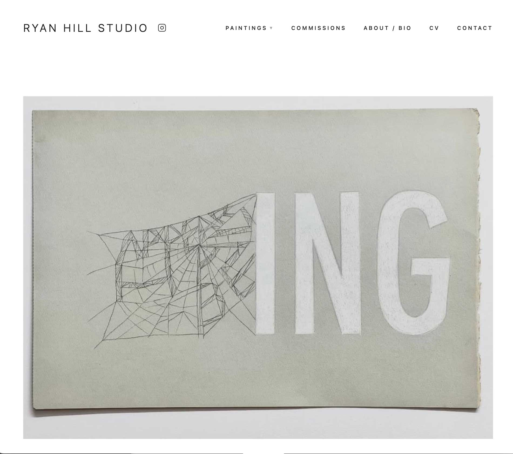
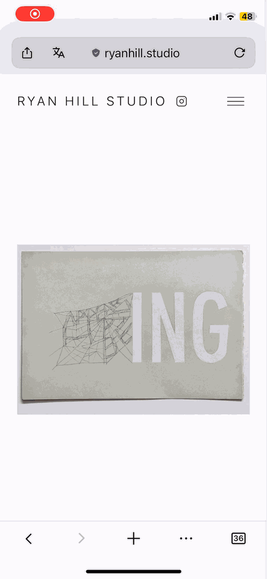
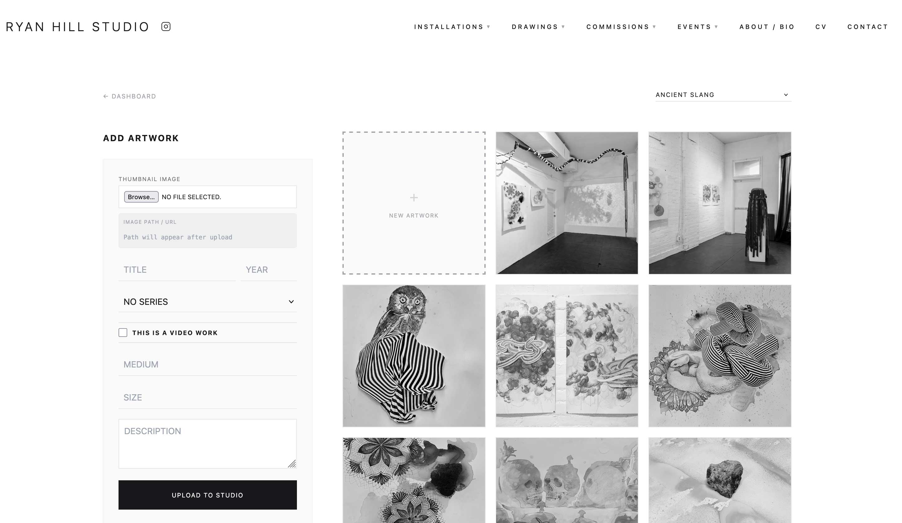
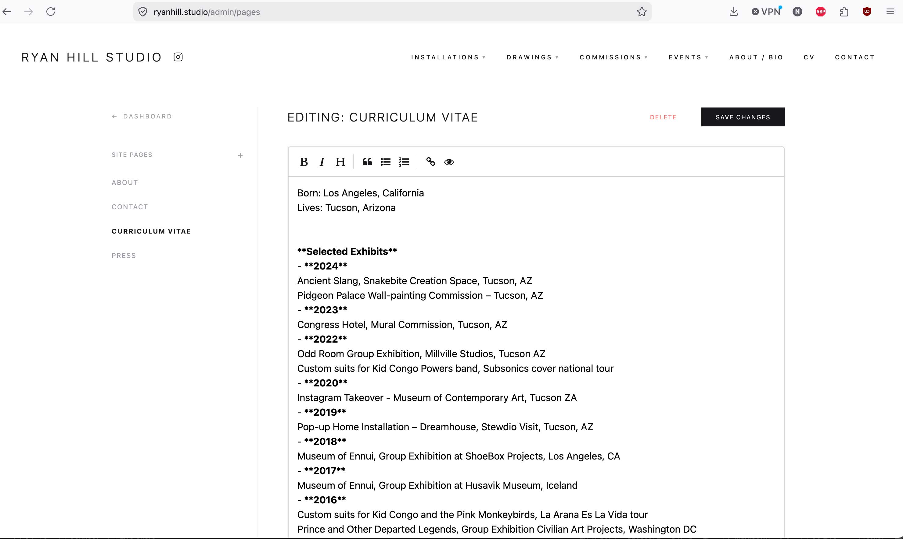
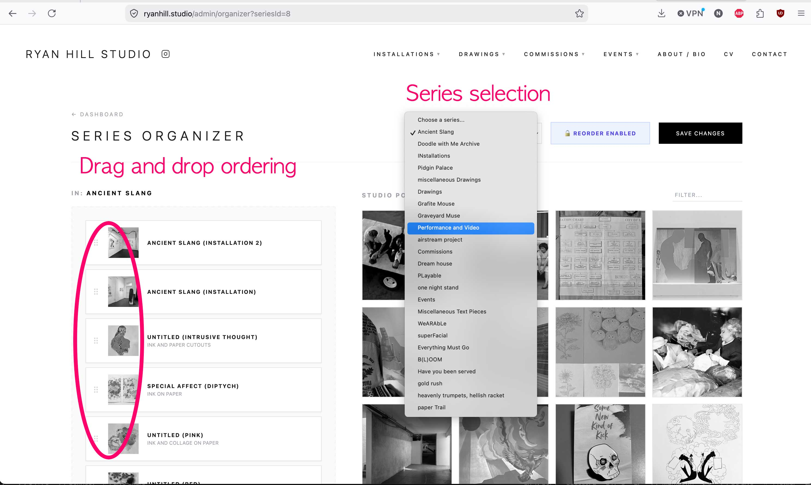
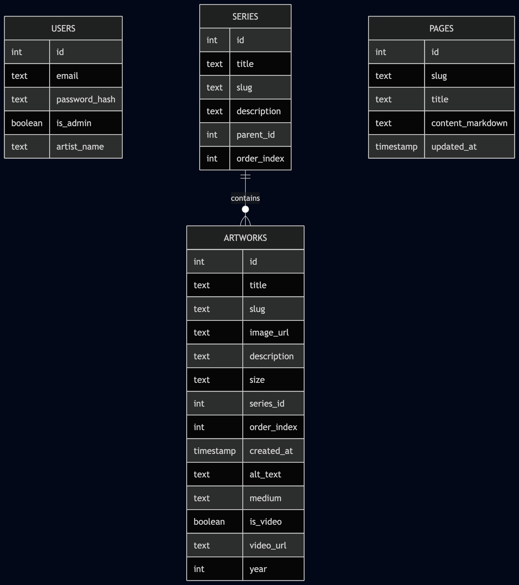
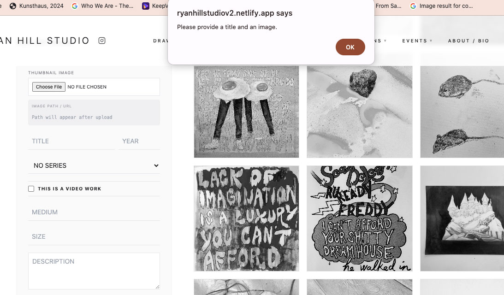
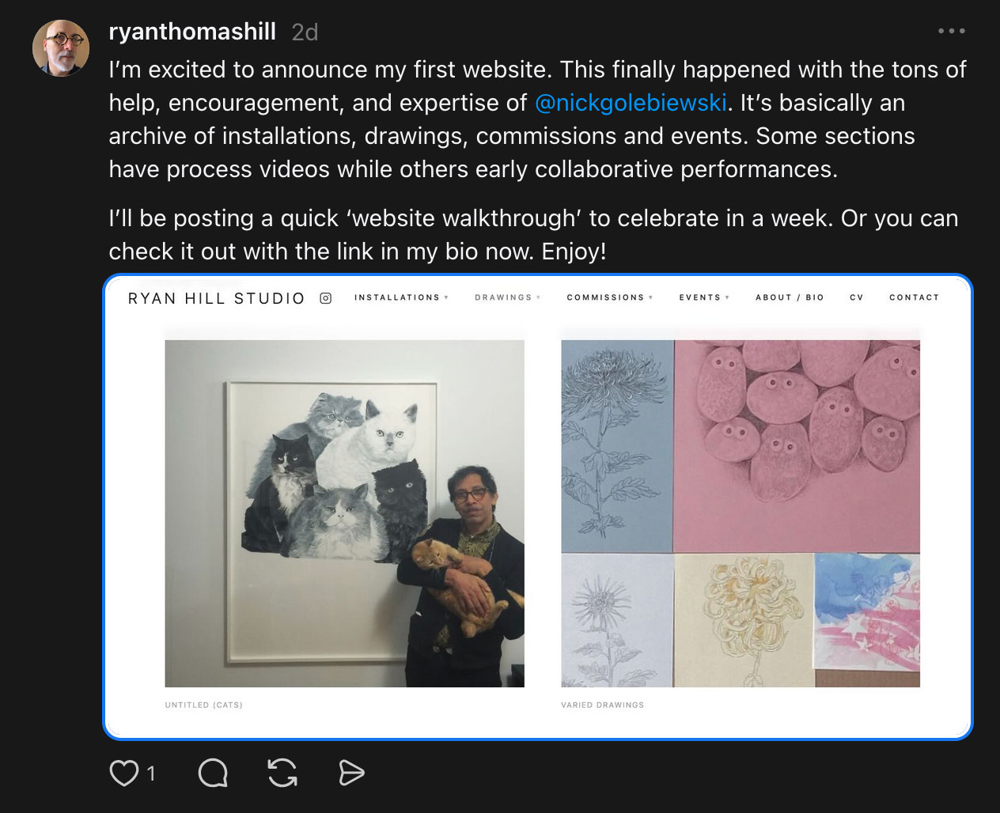

# Nick Golebiewski

Pinterest Presentation 📌
June 12, 2026

---
<div class="split-50-50">
<div class="col-left">

# Ryan Hill Studio

*An artist portfolio with Nuxt*
* Problem solved: An artist without a website other than ephemeral media like Instagram. Unique (like the art) alternative to a Squarespace portfolio, with full control of code and data.
* **Full-stack, single-admin web app that puts the art and artist first.**

[ryanhill.studio](https://ryanhill.studio)

</div>
<div class="col-right">

 
 
</div>
</div>

---


<!-- Full screen intro of project -->
<!-- 

--- -->

# 1. Tech Stack

---

**Frontend:** *Nuxt (Vue)* + *Tailwind CSS* + *TypeScript*

**Backend:** *Node.js* + *PostgreSQL* + *Argon2* + *escaped SQL (not ORM) API* 

**Infrastructure:** *Netlify* + *Neon* + *GitHub*


---

# 2. Website

---

<!-- Desktop View Split Layout -->
<div class="split-25-75">
<div class="col-left">

## Responsive Design

### Desktop & Laptop

Horizontal Flow

</div>
<div class="col-right">


</div>
</div>

---

<!-- Mobile View Split Layout -->
<div class="split-25-75">
<div class="col-left">

## Responsive Design

### Mobile Layout

Vertical Flow

</div>
<div class="col-right">



</div>
</div>

---

# Admin Dashboard

1. **Minimalist UI** 
2. **Intuitive UX:** Drag-and-drop ordering.
3. **Markdown Native:** Markdown editor for content pages (like the CV) instead of clunky HTML WYSIWYG editors.

---

<!-- Full screen image of admin dashboard -->


---

<!-- Full screen image of markdown editor featuring CV content -->


---

<!-- Full screen image of markdown editor featuring CV content -->


---

<div class="split-25-75">
<div class="col-left">

## Database Schema/ERD

</div>
<div class="col-right">



</div>
</div>

---

# 3. Challenges

---

<!-- # Challenges: Hydration & State

### Flickering Authentication
* **The Bug:** Admin users logging in successfully, only to be immediately booted out to the login screen on page refresh.
* **The Cause:** A classic Nuxt hydration mismatch between the server-side render state and client-side cookie validation execution. Caused by client side auth middleware conflicting with server side middleware
* **Coincidence?** Nuxt seems to have a 'persistent user issue', something similar happened in a Nuxt/Go project using Zitadel for OAuth and user login.

--- -->

# *"I'm not able to upload images anymore, it says to check the console for logs."* - User
---
## 'Boom', that's it!

```bash
May 5, 08:05:59 PM: c5f395eb INFO   🔐 [SERVER ADMIN AUTH] User: x@nickgolebiewski.com, Admin: true
May 5, 08:05:59 PM: c5f395eb INFO   🔐 [API MIDDLEWARE] POST /api/artworks/create
May 5, 08:05:59 PM: c5f395eb INFO   🔐 [API MIDDLEWARE] Checking auth for POST /api/artworks/create
May 5, 08:05:59 PM: c5f395eb INFO   🔐 [checkAuth] Starting auth check
May 5, 08:05:59 PM: c5f395eb INFO   🔐 [checkAuth] Authorization header: MISSING
May 5, 08:05:59 PM: c5f395eb INFO   🔐 [checkAuth] Token found: eyJhbGciOiJIUzI1NiJ9...
May 5, 08:05:59 PM: c5f395eb INFO   🔐 [checkAuth] All cookies: admin_token=...
May 5, 08:05:59 PM: c5f395eb INFO   🔐 [checkAuth] Token verified successfully for user: x@nickgolebiewski.com
May 5, 08:06:00 PM: c5f395eb ERROR  ❌ Artwork Post Error: error: duplicate key value violates unique constraint "artworks_slug_key"
  length: 202,
  severity: 'ERROR',
  code: '23505',
  detail: 'Key (slug)=(boom) already exists.',
  hint: undefined,
  position: undefined,
  internalPosition: undefined,
  internalQuery: undefined,
  where: undefined,
  schema: 'public',
  table: 'artworks',
  column: undefined,
  dataType: undefined,
  constraint: 'artworks_slug_key',
  file: 'nbtinsert.c',
  line: '667',
  routine: '_bt_check_unique'
}
May 5, 08:06:00 PM: c5f395eb Duration: 415.16 ms	Memory Usage: 180 MB
May 5, 08:06:45 PM: 60392751 INFO   🔐 [SERVER ADMIN AUTH] Processing GET /admin
```

---

# Challenges: The "Untitled" Conundrum

### URL Slug Collisions
* **The Setup:** Artists frequently title physical pieces *"Untitled"*. 
* **The DB Conflict:** The schema enforced a unique database constraint on the URL slug generated from the artwork's title. Submitting multiple 'untitled' pieces, for example caused upload failures.
* **The Pivot:** Wrote a function in the API Route with RegEx to catch duplicates and cleanly append a sequential 2-digit counter to the unique path string.

---

```typescript
// Helper function to generate unique slug
async function generateUniqueSlug(baseSlug: string): Promise<string> {
  try {
    // Fetch all slugs matching the base pattern in ONE query
    const result = await pool.query(
      `SELECT slug FROM artworks 
       WHERE slug = $1 OR slug LIKE $2 
       ORDER BY slug DESC`,
      [baseSlug, `${baseSlug}\\_%`]
    )
    
    if (result.rows.length === 0) {
      return baseSlug // No duplicates exist
    }

    // Parse existing slugs to find highest counter
    let maxCounter = 0
    for (const row of result.rows) {
      const match = row.slug.match(/_(\d{2})$/)
      if (match) {
        maxCounter = Math.max(maxCounter, parseInt(match[1]))
      }
    }

    // Generate next counter
    const nextCounter = maxCounter + 1
    if (nextCounter > 99) {
      throw createError({ statusCode: 400, 
      statusMessage: 'Unable to generate unique slug (too many duplicates)' })
    }

    return `${baseSlug}_${String(nextCounter).padStart(2, '0')}`
  } catch (err) {
    console.error('Error checking slug uniqueness:', err)
    throw err
  }
}
```


---


---

# Challenges: Still can't upload!

### Finding the Real Bug
* **The Twist:** The slug appending logic wasn't actually the core issue, although it would soon have been.
* **The Reality:** The test user profile just needed to clear a JWT cookie left over from a previous deployment build, there was an auth error behind the scenes.
* **The Win:** I had already built an "logout" button/functions that clears the local storage/cookie into the admin dashboard layout. Inititally with the idea, that you may want to logout! By hunting down a found data-flow collision, I uncovered the real, and obvious if you are a developer, not a client, sort of issue.

---

<!-- # Challenges:Video Streams

### 4. YouTube & Shorts Integration
* **The Goal:** Seamlessly render video streaming feeds and auto-extract high-quality cover thumbnails directly from video links inside the artwork submission forms. YouTube is great at streaming video and embeds, the artist already had a bunch uploaded, so that became the plan.
* **The Catch:** Factoring in the variable URL structural states of traditional YouTube desktop links, embedded objects, share links, and modern mobile YouTube Shorts. i.e. "The videos aren't working."

---

# Video Embed Link Processing Code


```typescript
async (newUrl) => {
    if (!newUrl || !newArtwork.value.is_video) return;

    const match = newUrl.match(
      /(?:youtube\.com\/(?:watch\?v=|shorts\/|embed\/)|youtu\.be\/)([\w-]{11})/,
    );

    const videoId = match ? match[1] : null;

    if (videoId) {
      // Auto thumbnail
      newArtwork.value.image_url =
        `https://img.youtube.com/vi/${videoId}/hqdefault.jpg`;

      // Auto title via YouTube oEmbed

      try {
        const oEmbed = await $fetch(
          `https://www.youtube.com/oembed?url=${encodeURIComponent(newUrl)}&format=json`,
        );

        if (oEmbed?.title && !newArtwork.value.title) {
          newArtwork.value.title = oEmbed.title;
        }
      }...

```
--- -->

# 4. AI Use

---
# AI & Workflow Efficiency

Using **GitHub Copilot Workspace** with agent model **Claude Haiku 4.5**. 

- **The Workflow:** Generated an isolated GitHub Codespace directly from an Issue—automating branch creation and environment setup.
- **Token Efficiency:** Remarkably efficient compared to desktop VS Code extensions, allowing debugging entirely within the free tier.
- **The Secret:** Spending time upfront writing highly detailed, structured GitHub Issues paid off massively in AI accuracy. [Link: Example Issue for admin backend.](https://github.com/ngolebiewski/ryan-hill-studio-v2/issues/3)


---
# AI Next Steps
###  Next Steps
- Reduce copy/paste workflow with free chat models when GitHub tokens run out
- Have the agent create testing (playwright, jest, etc.) & security checks
- Agent-driven iterations pushed directly to PR review


### On the Agenda
- Setting up a local **Ollama** instance running **Qwen2.5-Coder** on a Raspberry Pi 5 (with AI Hat), networked securely over a **Tailscale VPN**. 
- Use this as the model for **Cursor** which unlike **Claude Code** is not locked into a specific closed source set of models


---

# 5. Key Takeaways

---

- **Argon2 generates different hashes in different environments** 
* **My trio of goals were met in this project:**
  * 1. Get the feel of Nuxt
  * 2. Build a cutom, responsive, minimal and easy to use portfolio app for an artist.
  * 3. In the end, have a portfolio item to share.

---

<div class="split-25-75">
<div class="col-left">

# Thank you & Questions?

**Nick Golebiewski**

Site: 
[ryanhill.studio](https://ryanhill.studio/)
Code: 
[github.com/ngolebiewski/ryan-hill-studio-v2/](https://github.com/ngolebiewski/ryan-hill-studio-v2/)
</div>
<div class="col-right">



</div>
</div>
